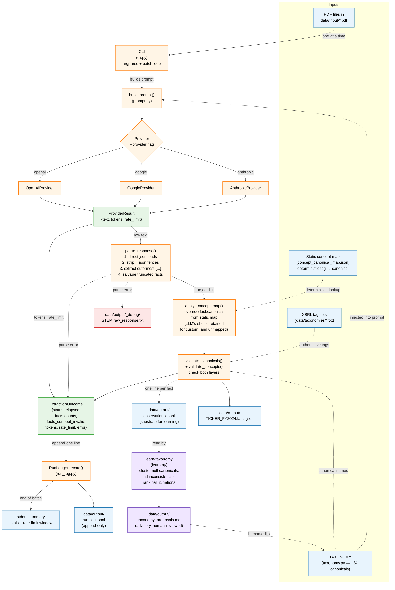

# pdf-extraction

Extract XBRL-style financial facts from a folder of annual report PDFs (US 10-Ks, foreign 20-Fs, IFRS annual reports — anything with financial statements). One JSON file out per PDF in. Works with **Anthropic Claude**, **Google Gemini**, or **OpenAI GPT** as the underlying LLM.

---

## Table of contents

1. [What it does (and what it doesn't)](#what-it-does-and-what-it-doesnt)
2. [The mental model: three names per fact](#the-mental-model-three-names-per-fact)
3. [Design choices and why](#design-choices-and-why)
4. [Project layout](#project-layout)
5. [Data workflow](#data-workflow)
6. [Setup](#setup)
7. [Usage](#usage)
8. [Output schema](#output-schema)
9. [Run log and observations](#run-log-and-observations)
10. [Cross-company analysis](#cross-company-analysis)
11. [Extending the canonical taxonomy](#extending-the-canonical-taxonomy)
12. [Cost (rough, per 100-page filing)](#cost-rough-per-100-page-filing)
13. [Limitations](#limitations)
14. [Development](#development)

---

## What it does (and what it doesn't)

**Does**:
- Read a PDF annual/interim report end-to-end via an LLM with native PDF support.
- Emit a structured JSON file with `entity`, `filing`, `periods`, and a `facts[]` array — one fact per numeric line item, including both primary statements and note tables.
- Tag every fact three ways: a cross-company canonical name, the native XBRL-style tag, and the exact printed label (in the original language).
- Validate every concept against authoritative XBRL element lists built from real SEC filings, and flag likely hallucinations.
- Append append-only logs that capture per-PDF metrics (`run_log.jsonl`) and per-fact observations (`observations.jsonl`) for downstream analysis and a future learning loop.

**Does not**:
- Replace human review for regulatory work. The LLM is high-recall but not auditor-grade; values, signs, and scale should be spot-checked.
- Translate. Labels are kept in the source language so you can always trace back to the exact wording.
- Parse PDFs deterministically without an LLM. The whole point of this tool is to handle filings that *don't* come with machine-readable XBRL (private, foreign, scanned, etc.).
- Auto-mutate the canonical taxonomy. New canonical entries always go through human review (see the [learning loop](#extending-the-canonical-taxonomy)).

---

## The mental model: three names per fact

This is the single most important concept in the project. Every extracted fact carries **three independent name fields** that serve three different purposes:

| Field | Source | Purpose | Example (Apple 10-K) | Example (LVMH IFRS report, French) |
|---|---|---|---|---|
| `canonical` | Hand-curated taxonomy in [taxonomy.py](src/pdf_extraction/taxonomy.py) | **Cross-company joins.** Same value across all companies/standards/languages. | `Revenue` | `Revenue` |
| `concept` | The native XBRL-style tag the company would (or does) use | **Audit trail to the standard.** Validated against authoritative tag lists. | `us-gaap:Revenues` | `ifrs-full:Revenue` |
| `label` | The line-item label EXACTLY as printed in the source PDF | **Traceability to the original document.** Original language preserved. | `Total net sales` | `Chiffre d'affaires` |

So if you ask *"what's the revenue for Apple, LVMH, and Toyota in their latest filings?"*, you join on `canonical == "Revenue"` and still get the company-specific tag and the exact original wording on every row. No information is lost in normalization.

If a fact has no good canonical match (e.g. a company-specific KPI or an obscure disclosure), `canonical` is `null` and you still have `concept` + `label` to work with. The system never invents canonical names.

---

## Design choices and why

These are the non-obvious decisions worth understanding before reading the code.

### 1. Why use an LLM at all?

SEC filers already submit machine-readable XBRL alongside their 10-Ks. Why not just parse that? Because:

- Foreign filers (20-F, F-1) often submit IFRS-tagged XBRL, but many *don't* have XBRL at all.
- Annual reports of non-public companies, EU annual reports, scanned PDFs, and historical filings have no XBRL.
- Filings that *do* have XBRL still need normalization across standards (us-gaap vs. ifrs-full).

An LLM with native PDF reading handles all of these uniformly. The tradeoff is non-determinism and cost; the mitigation is the validation layers described below.

### 2. Why three name fields instead of one?

A single "standardized name" loses information. A single "original label" doesn't join across companies. By keeping all three, the canonical layer enables analysis and the label layer enables audit. The `concept` layer sits in between as an XBRL-style trace.

### 3. Why TWO taxonomies (canonical AND authoritative XBRL lists)?

They serve different roles:

| | `taxonomy.py` (canonical) | `data/taxonomies/*.txt` (authoritative XBRL) |
|---|---|---|
| **What** | 134 hand-curated cross-standard concepts | ~3,400 element names from real SEC filings |
| **Source** | Human-curated | SEC EDGAR companyfacts API |
| **Constrains** | The `canonical` field | The `concept` field |
| **Validates** | "Did the LLM map to a real canonical?" | "Is this tag actually a member of the official taxonomy?" |
| **Catches** | Wrong / made-up canonical names | LLM-hallucinated XBRL tags |

The canonical layer is curated to be small, semantically meaningful, and cross-standard. The XBRL layer is large, authoritative, and standard-specific. Together they catch errors at two levels.

### 4. Why empirically-observed XBRL tags, not the full theoretical taxonomy?

The full FASB us-gaap taxonomy has ~15,000 element names; most are unused. We instead union the tags actually used by 13 diverse real SEC filers (Apple, Microsoft, JPMorgan, Berkshire, Pfizer, ExxonMobil, etc.) plus 3 IFRS filers (Novartis, AstraZeneca, Sanofi), yielding ~2,849 us-gaap and ~591 ifrs-full tags.

Why this is better than the full list:
- Catches hallucinations more sharply (the LLM can't sneak in obscure tags no real filer uses).
- Survives FASB's annual taxonomy churn — older filings use older versions, and they're all merged here.
- Easily refreshable by re-running [scripts/fetch_taxonomies.py](scripts/fetch_taxonomies.py) and broadening the seed set of filers.

See [data/taxonomies/README.md](data/taxonomies/README.md) for the full sourcing methodology.

### 5. Why preserve the original `label` (and not translate)?

Because the label is the audit anchor. If you ever question whether the LLM mapped a fact correctly, you compare the label against the source PDF. Translating it would *break* this trace. A French filer's `Chiffre d'affaires` mapping to `canonical: Revenue` is verifiable by anyone who can read French; `canonical: Revenue` with `label: "Revenue (translated)"` is not verifiable.

### 6. Why is `canonical: null` acceptable?

Because the alternative — forcing the LLM to invent a canonical that doesn't really fit — is worse. A null canonical means "we extracted this fact but it doesn't map cleanly to any concept in our cross-company vocabulary." Downstream you can still use `concept` and `label`, and the [learning loop](#extending-the-canonical-taxonomy) treats recurring `null` clusters as candidates for new canonical entries.

### 7. Why per-PDF processing, not batched prompts?

Three reasons: (a) prompt size — even one 10-K plus the prompt is large; batching multiple is impractical and degrades attention; (b) error isolation — one bad filing doesn't poison a batch; (c) trivial parallelism — once you want to process hundreds of PDFs, per-PDF independence is essential.

### 8. Why three providers (Anthropic / Google / OpenAI)?

Same prompt, three backends behind a `Provider` abstraction. Lets you A/B test quality on the same filing, route by cost (Gemini Flash for bulk, Sonnet/Opus for hard cases), and avoid hard-locking to one vendor. The CLI picks the provider via `--provider`.

### 9. Why append-only logs?

`run_log.jsonl` and `observations.jsonl` are never rewritten. Re-running the CLI just appends more records. This lets you:
- Track throughput, token spend, and failure rates over time.
- Replay historical observations through new analysis (the learning loop).
- Debug regressions by diffing log ranges.

### 10. Why a learning loop instead of letting the LLM expand the canonical list itself?

Because the LLM doesn't get to silently grow the cross-company vocabulary. Letting it would mean the canonical taxonomy drifts every run and joins break. Instead:

1. The LLM emits `canonical: null` when nothing fits.
2. Observations are accumulated to `observations.jsonl` on every successful extraction.
3. `learn-taxonomy` clusters recurring `null` facts by concept, surfaces concept→canonical inconsistencies, and ranks likely hallucinated XBRL tags — writing all of it to `taxonomy_proposals.md`.
4. **A human reviews the proposals** and edits [taxonomy.py](src/pdf_extraction/taxonomy.py).

The data is what proposes; the human is what decides. See [Extending the canonical taxonomy](#extending-the-canonical-taxonomy) below for the full loop and how to actually run it.

### 11. Why a static `concept → canonical` map on top of the LLM?

Because asking the LLM to re-derive `us-gaap:Revenues → Revenue` on every single extraction is wasteful and occasionally inconsistent. Across hundreds of filings, the same tag should always produce the same canonical — but the LLM, being stochastic, occasionally disagrees with itself (we've seen the same `concept` mapped to two different canonicals across runs).

The static map ([data/taxonomies/concept_canonical_map.json](data/taxonomies/concept_canonical_map.json)) is built once by [scripts/build_concept_map.py](scripts/build_concept_map.py), which asks an LLM in a one-shot batch pass: for each of the ~3,400 tags in our authoritative XBRL lists, which canonical fits best (or null)?

After it exists, the extractor:
- Looks up every fact's `concept` in the map.
- If covered: overrides the fact's `canonical` with the map's answer. Deterministic, no per-run drift.
- If not covered (e.g. `custom:*`): keeps the LLM's choice. The LLM only does real work on the company-specific stuff.

This makes canonical assignment **mostly a hash lookup** instead of a per-extraction LLM decision. Three concrete benefits: (a) consistent across runs, (b) faster and cheaper, (c) when LLM and map disagree, the disagreement is *logged* — which is signal for whether the map needs refreshing.

The map itself is built by an LLM, so it's not infallible — but it's built **once** and reviewed **once**, instead of being re-derived (and re-mistakenly) on every filing. Human-readable version: [data/taxonomies/concept_canonical_map.md](data/taxonomies/concept_canonical_map.md).

---

## Project layout

```
pdf-extraction/
├── README.md                       # this file
├── pyproject.toml                  # package metadata + dependencies + console-script entry
├── extract_financials.py           # back-compat shim — works without `pip install -e .`
├── .env.example                    # template for provider API keys
├── .gitignore
├── src/
│   └── pdf_extraction/             # the importable package
│       ├── __init__.py
│       ├── __main__.py             # `python -m pdf_extraction` entry
│       ├── cli.py                  # argparse + batch loop + end-of-run summary
│       ├── extractor.py            # PDF → LLM → parsed JSON → validation → outputs
│       ├── prompt.py               # the extraction prompt (taxonomy injected at build time)
│       ├── taxonomy.py             # CANONICAL TAXONOMY — 134 hand-curated concepts
│       ├── xbrl_taxonomies.py      # loads authoritative XBRL tag sets; validates `concept`
│       ├── learn.py                # `learn-taxonomy` CLI — mines observations.jsonl, writes proposals
│       ├── run_log.py              # append-only JSONL per-PDF run log
│       └── providers/
│           ├── __init__.py         # PROVIDERS registry
│           ├── base.py             # Provider abstract base class + ProviderResult
│           ├── anthropic_provider.py
│           ├── google_provider.py
│           └── openai_provider.py
├── scripts/
│   ├── fetch_taxonomies.py         # rebuilds data/taxonomies/*.txt from SEC EDGAR
│   └── build_concept_map.py        # builds the static concept→canonical mapping (idempotent)
├── data/
│   ├── input/                      # drop your PDFs here
│   │   └── apple_fy2024_10k.pdf
│   ├── output/                     # per-PDF JSON files, run_log.jsonl, observations.jsonl, taxonomy_proposals.md
│   └── taxonomies/                 # AUTHORITATIVE XBRL TAG LISTS + STATIC MAPPING (see its README.md)
│       ├── us-gaap.txt             # 2,849 element names from 13 US filers
│       ├── ifrs-full.txt           #   591 element names from 3 IFRS filers
│       ├── dei.txt                 #     3 element names
│       ├── concept_canonical_map.json   # static `concept → canonical` lookup (built by build_concept_map.py)
│       ├── concept_canonical_map.md     # human-readable version of the above
│       ├── _provenance.json        # which filers contributed
│       └── README.md               # sourcing methodology and refresh procedure
└── examples/
    └── AAPL_FY2024.facts.json      # reference output (hand-built; ~217 facts)
```

The top-level [extract_financials.py](extract_financials.py) is a thin shim that adds `src/` to `sys.path` and forwards to the package CLI. Useful when you haven't run `pip install -e .` and just want to run the script directly. New code should import from the `pdf_extraction` package.

---

## Data workflow



What this picture says, in words:

**Extraction pipeline (every batch run)**

1. The CLI iterates over PDFs in the input folder, one at a time.
2. For each PDF it builds the prompt (with the canonical taxonomy injected so the LLM can see the canonical names available) and sends it to the chosen provider.
3. The provider response is parsed (with several fallbacks for fenced markdown, truncation, etc.).
4. The **static concept map** is applied: for every fact whose `concept` is in [data/taxonomies/concept_canonical_map.json](data/taxonomies/concept_canonical_map.json), the LLM's `canonical` is overridden by the map's deterministic answer. Facts whose `concept` is `custom:*` or otherwise not in the map keep the LLM's choice. Disagreements between LLM and map are counted (`facts_canonical_disagreements`).
5. Both validators run: `validate_canonicals` checks the `canonical` field against [taxonomy.py](src/pdf_extraction/taxonomy.py); `validate_concepts` checks the `concept` field against the authoritative XBRL lists in [data/taxonomies/](data/taxonomies/).
6. The per-PDF JSON file is written, the per-fact observations are appended to `observations.jsonl`, and a one-line run record is appended to `run_log.jsonl`.
7. After all PDFs, the CLI prints a summary.

**Learning loop (offline, run periodically)**

7. `learn-taxonomy` reads `observations.jsonl` and produces `taxonomy_proposals.md`: clustered `canonical: null` recurrences (proposals for new canonicals), concept→canonical inconsistencies (LLM indecision to investigate), and ranked hallucinated XBRL tags (concepts not in `data/taxonomies/`).
8. **You** review `taxonomy_proposals.md` and edit [taxonomy.py](src/pdf_extraction/taxonomy.py) by hand. The next extraction picks up the new canonicals automatically. This human-in-the-loop step is *Phase 4*.

---

## Setup

1. **Install Python 3.10+**: `python3 --version`. If you're on macOS and only have system Python 3.9, install a newer one via Homebrew: `brew install python@3.13`.

2. **Create and activate a virtual environment** in the project folder:

   ```bash
   cd "/path/to/pdf extraction"
   python3 -m venv .venv
   source .venv/bin/activate          # macOS / Linux
   # .venv\Scripts\activate           # Windows PowerShell
   ```

   Your shell prompt should now show `(.venv)` at the start.

3. **Upgrade pip** (older pip versions can't do PEP 660 editable installs from `pyproject.toml`):

   ```bash
   python3 -m pip install --upgrade pip
   ```

4. **Install the package** (editable mode, with the SDK extras you want):

   ```bash
   pip install -e ".[anthropic]"      # just Anthropic
   pip install -e ".[google]"         # just Gemini
   pip install -e ".[openai]"         # just GPT
   pip install -e ".[all]"            # all three SDKs
   ```

   Editable mode (`-e`) means edits to files in `src/` take effect immediately without reinstalling. This step is what creates the `extract-financials` command in your venv's `bin/`.

5. **Set your API key(s).** Copy `.env.example` to `.env`, fill in the keys you need, then load them into your shell:

   ```bash
   cp .env.example .env
   # edit .env in your editor and paste the key(s)
   set -a; source .env; set +a       # macOS / Linux — loads .env for this shell session
   ```

   For permanence: add `export ANTHROPIC_API_KEY=...` to `~/.zshrc` / `~/.bashrc`. On Windows: `setx ANTHROPIC_API_KEY "sk-ant-..."` and reopen the shell.

### Re-using the venv later

```bash
cd "/path/to/pdf extraction"
source .venv/bin/activate
extract-financials data/input --out-dir data/output    # short form (after pip install -e .)
# or, if you skipped the install step:
python extract_financials.py data/input --out-dir data/output
```

`deactivate` returns your shell to the system Python.

---

## Usage

### Quickstart — full end-to-end

Assuming you've completed [Setup](#setup) and your venv is active with the chosen provider's SDK installed:

```bash
# 1. Drop one or more PDFs into the input folder
cp /path/to/your-filing.pdf data/input/

# 2. Run the extractor
extract-financials data/input

# That's it. Output JSON lands in data/output/, and you'll see something like:
#
#   Found 1 PDF(s) in /path/to/data/input
#   Output dir: /path/to/data/output
#   Log file:   /path/to/data/output/run_log.jsonl
#   Provider:   anthropic
#   Model:      sonnet
#
#   Resolved model: claude-sonnet-4-6
#
#   [1/1] your-filing.pdf
#     → reading PDF (1.2 MB) via anthropic/claude-sonnet-4-6...
#     ✓ Apple Inc. 10-K FY2024 — 985 facts (612 canonical-mapped) · 50,572 tokens · 47.3s
#     → wrote AAPL_FY2024.facts.json
#
#   ============================================================
#   Run summary  (1 PDFs processed)
#   ============================================================
#     Succeeded:        1
#     Failed:           0
#     ...
```

After the run, your output folder contains:

```
data/output/
├── AAPL_FY2024.facts.json     # the structured extraction (per PDF)
├── run_log.jsonl              # one line per PDF processed (append-only across runs)
└── observations.jsonl         # one line per fact (append-only, substrate for the learning loop)
```

Inspect the result with `jq`:

```bash
# How many facts did we get? How many were canonical-mapped?
jq '.facts | length' data/output/AAPL_FY2024.facts.json
jq '[.facts[] | select(.canonical != null)] | length' data/output/AAPL_FY2024.facts.json

# Pull just the revenue line(s)
jq '.facts[] | select(.canonical == "Revenue")' data/output/AAPL_FY2024.facts.json

# Did the LLM hallucinate any XBRL tags?
jq -r 'select(.concept_valid == false) | .concept' data/output/observations.jsonl | sort -u
```

### Three invocation forms

Pick whichever works in your setup:

| Form | When it works |
|---|---|
| `extract-financials …` | After `pip install -e ".[…]"`. Cleanest. |
| `python -m pdf_extraction …` | After install. |
| `python extract_financials.py …` | Always works — the root-level shim adds `src/` to `sys.path` itself, no install needed. |

> **`zsh: command not found: extract-financials`?** You haven't installed the package (or you installed in a different venv). Either run `pip install -e ".[anthropic]"`, or fall back to `python extract_financials.py …`.

### Common commands

```bash
# Default: Anthropic Claude Sonnet
# If input folder is named 'input', output goes to a sibling 'output' folder.
extract-financials data/input

# Override the output folder
extract-financials data/input --out-dir my_results/

# Use Gemini Pro
extract-financials data/input --provider google --model gemini-2.5-pro

# Use Gemini Flash (cheapest)
extract-financials data/input --provider google --model flash

# Use GPT-5
extract-financials data/input --provider openai --model gpt5

# See what would run without spending API credits
extract-financials data/input --dry-run

# Resume after a crash — only processes PDFs without an existing JSON
extract-financials data/input --skip-existing

# Bigger output budget for very dense filings (default is 32000)
extract-financials data/input --max-tokens 64000
```

### Model aliases

| Provider | Aliases | Default | Underlying models |
|---|---|---|---|
| `anthropic` | `opus`, `sonnet`, `haiku` | `sonnet` | claude-opus-4-6, claude-sonnet-4-6, claude-haiku-4-5 |
| `google` | `pro`, `flash` | `flash` | gemini-2.5-pro, gemini-2.5-flash |
| `openai` | `gpt5`, `gpt5mini`, `gpt4o` | `gpt5mini` | gpt-5, gpt-5-mini, gpt-4o |

You can also pass any full model id (e.g. `--model claude-opus-4-6`).

### Output behavior

- **On success**: writes `<TICKER>_FY<YEAR>.facts.json` to the output folder.
- **Markdown / prose wrapping**: parsed away automatically.
- **Truncation**: if the model ran out of output budget, parser recovers all complete facts and adds `"_truncated": true` to the file. The CLI prints a warning suggesting `--max-tokens 64000`. Re-run that filing with the higher budget for the full set.
- **Unparseable response**: raw text is dumped to `<out_dir>/_debug/<stem>.raw_response.txt` for inspection.

---

## Output schema

```json
{
  "entity": {
    "name": "Apple Inc.", "ticker": "AAPL", "exchange": "NASDAQ",
    "cik": "0000320193", "country": "United States",
    "fiscal_year_end": "09-28", "reporting_currency": "USD",
    "accounting_standard": "US-GAAP"
  },
  "filing": {
    "form": "10-K", "fiscal_year": 2024, "period_end": "2024-09-28",
    "filing_date": "2024-11-01", "auditor": "Ernst & Young LLP",
    "source_pdf": "apple_fy2024_10k.pdf"
  },
  "periods": {
    "FY2024": {"type": "duration", "start": "2023-10-01", "end": "2024-09-28"},
    "instant_2024-09-28": {"type": "instant", "date": "2024-09-28"}
  },
  "facts": [
    {
      "canonical": "Revenue",
      "concept":   "us-gaap:Revenues",
      "label":     "Total net sales",
      "value":     391035,
      "unit":      "USD",
      "scale":     "millions",
      "period":    "FY2024",
      "statement": "IncomeStatement",
      "page":      29
    },
    {
      "canonical":  "SegmentRevenue",
      "concept":    "custom:SegmentNetSales",
      "label":      "Americas",
      "value":      167045,
      "unit":       "USD",
      "scale":      "millions",
      "period":     "FY2024",
      "statement":  "Note_13_Segments",
      "page":       47,
      "dimensions": {"Segment": "Americas"}
    }
  ]
}
```

Key things to know:
- **Values are NOT normalized.** `value: 391035` with `scale: "millions"` means $391,035M = $391.035B. The scale stays exactly as the company printed it.
- **Periods are defined once** in the `periods` dict and referenced by id on each fact.
- **Dimensions** appear on facts that disaggregate something (segments, geography, product line) and are omitted otherwise.
- `concept: "custom:*"` means the LLM did not find a match in any official taxonomy — the tag is company-specific (segments, KPIs, non-GAAP measures). These are NOT validated against `data/taxonomies/`.

A reference output (hand-built, ~217 facts) lives in [examples/AAPL_FY2024.facts.json](examples/AAPL_FY2024.facts.json).

---

## Run log and observations

The CLI maintains two append-only files in the output folder. Together they support post-run analysis, throughput tracking, and the learning loop.

### `run_log.jsonl` — one record per PDF

Each line is a complete record of one PDF run. Override the path with `--log-file`; default is `<out_dir>/run_log.jsonl`.

```jsonc
{
  "timestamp":              "2026-05-09T13:45:32.418Z",   // when record was written
  "started_at":             "2026-05-09T13:44:45.092Z",   // when API call began
  "pdf":                    "apple_fy2024_10k.pdf",
  "pdf_size_bytes":         1093835,
  "provider":               "anthropic",
  "model":                  "claude-sonnet-4-6",
  "elapsed_seconds":        47.32,
  "status":                 "success",                    // success | skipped | parse_error | api_error
  "facts_total":            985,
  "facts_canonical":        612,
  "facts_dimensioned":      80,
  "facts_concept_invalid":  4,                            // concepts NOT in authoritative XBRL list
  "facts_canonical_from_map":      540,                   // canonicals assigned by the static concept map
  "facts_canonical_disagreements": 22,                    // subset where the LLM had a different opinion
  "tokens_input":           32140,
  "tokens_output":          18432,
  "tokens_total":           50572,
  "rate_limit":             { /* populated from response headers */ },
  "output_file":            "AAPL_FY2024.facts.json",
  "truncated":              false,
  "error":                  null
}
```

Token counts come directly from each provider's `usage` field — these are real per-request metrics, not estimates. Account credit balance is NOT included because providers don't expose it through their APIs; check the provider billing dashboard for real remaining credit.

### `observations.jsonl` — one record per fact

A flat per-fact log written on every successful extraction. This is the **substrate for the learning loop**: a future analysis step reads this file across many runs to propose new canonical taxonomy entries.

```jsonc
{
  "ts":             "2026-05-09T13:44:45.092Z",
  "pdf":            "apple_fy2024_10k.pdf",
  "concept":        "us-gaap:Revenues",
  "label":          "Total net sales",
  "statement":      "IncomeStatement",
  "canonical":      "Revenue",
  "period":         "FY2024",
  "unit":           "USD",
  "concept_valid":  true                                  // true | false | null
}
```

`concept_valid` is the result of `is_valid_concept(concept)`:
- `true` if the namespace is tracked and the tag is in the authoritative list.
- `false` if the namespace is tracked but the tag is **not** in the list (likely hallucination).
- `null` if the namespace isn't validated (e.g. `custom:*` or an unrecognized namespace).

### End-of-batch summary

```
============================================================
Run summary  (3 PDFs processed)
============================================================
  Succeeded:        3
  Failed:           0
  Skipped:          0
  Total elapsed:    142s
  Total tokens in:  96,420
  Total tokens out: 55,300
  Total tokens:     151,720
  Total facts:      2,940 (1,830 canonical-mapped)
  Concept-invalid:  47 (tags not in authoritative XBRL list — see data/taxonomies/)
  Run log:          data/output/run_log.jsonl
```

### Analyzing the log

```bash
# Total tokens spent on a recent batch
jq -s 'map(.tokens_total) | add' data/output/run_log.jsonl

# Average elapsed time per successful PDF
jq -s '[.[] | select(.status == "success") | .elapsed_seconds] | add / length' data/output/run_log.jsonl

# Find the slowest filing
jq -s 'max_by(.elapsed_seconds) | {pdf, elapsed_seconds, tokens_total}' data/output/run_log.jsonl

# What concepts is the LLM inventing? (group invalid ones from observations)
jq -r 'select(.concept_valid == false) | .concept' data/output/observations.jsonl \
  | sort | uniq -c | sort -rn | head -20
```

---

## Cross-company analysis

The `canonical` field makes this kind of query trivial:

```python
import json, glob

filings = [json.load(open(p)) for p in glob.glob("data/output/*.facts.json")]

for f in filings:
    rev = next((x for x in f["facts"]
                if x["canonical"] == "Revenue"
                and x["period"] == f"FY{f['filing']['fiscal_year']}"
                and "dimensions" not in x), None)
    if rev:
        scale_mult = {"millions": 1e6, "thousands": 1e3, "billions": 1e9, "actual": 1}[rev["scale"]]
        in_currency = rev["value"] * scale_mult
        print(f"{f['entity']['name']:30s} {rev['label']:30s} {in_currency:>20,.0f} {rev['unit']}")
```

The `label` field tells you exactly how each company worded it, in the original language, so you can audit any unexpected match.

---

## Extending the canonical taxonomy

### Manual addition (today)

Open [src/pdf_extraction/taxonomy.py](src/pdf_extraction/taxonomy.py) and add an entry:

```python
TAXONOMY = {
    ...,
    "FreeCashFlow": "Operating cash flow minus capex (often presented in MD&A)",
}
```

The next run will let the LLM choose `FreeCashFlow`. If a fact has no good canonical match, the LLM sets `canonical: null` and you still have `concept` + `label` to work with.

### Learning loop

The long-term plan is to grow the canonical taxonomy from observed data, not from guesses. The pieces:

| Phase | Status | What it does |
|---|---|---|
| 1. Authoritative XBRL tag lists + validation | **Done** | `data/taxonomies/*.txt`, `xbrl_taxonomies.py`, `facts_concept_invalid` in run log |
| 2. Per-fact observation log | **Done** | `observations.jsonl` written on every successful extraction |
| 3. Learning analyzer | **Done** | `learn-taxonomy` CLI: reads observations, clusters frequent `canonical: null` facts by concept, writes `taxonomy_proposals.md` for human review |
| 4. Curation workflow | Manual | A human reads the proposals and edits `taxonomy.py` — no auto-apply |

The crucial property: **the canonical taxonomy never auto-mutates**. The data proposes; a human decides. This keeps the cross-company vocabulary disciplined.

#### Running the analyzer

```bash
learn-taxonomy                                      # reads data/output/observations.jsonl, writes data/output/taxonomy_proposals.md
learn-taxonomy --min-frequency 3                    # only propose clusters seen 3+ times
learn-taxonomy --obs-file /path/to/obs.jsonl --out proposals.md
```

The generated `taxonomy_proposals.md` has three sections:

1. **Proposed canonicals** — concepts whose facts are recurringly tagged `canonical: null`. The analyzer suggests a CamelCase name (derived from the concept's local part), shows the labels actually seen across filings, and gives you a copy-paste-ready `taxonomy.py` entry with `"TODO — describe this concept"` for you to fill in.
2. **Mapping inconsistencies** — the same `concept` mapped to different canonicals across the corpus. Some are legitimate (e.g. `us-gaap:ShareBasedCompensation` is correctly mapped to `ShareBasedCompensationExpense` in the income statement context and to `ShareBasedCompensationCF` in the cash-flow context); others reveal genuine LLM indecision worth investigating.
3. **Likely hallucinated XBRL tags** — concepts where `concept_valid` is `false`. These are tags the LLM invented in a tracked namespace. Either the tag really doesn't exist (and the LLM should have used `custom:*`), or it's a real tag missing from our seed-filer union — in which case extend the seed list in `scripts/fetch_taxonomies.py` and re-run the fetcher.

Phase 3 is most useful with **observations from many filings**. With a single filing the proposals capture only that company's gaps; with 10+ filings across sectors the recurring patterns become the real signal.

> If you've just added a new `learn-taxonomy` script and your shell can't find it: re-run `pip install -e ".[…]"` to register the new console script entry in your venv.

#### How to review `taxonomy_proposals.md` (Phase 4)

Phase 4 is the *human-in-the-loop* curation step. It's not code — it's the discipline of deciding what enters the canonical vocabulary. Here's the workflow:

1. **Open the file**: [data/output/taxonomy_proposals.md](data/output/taxonomy_proposals.md). It has three sections — proposed canonicals, mapping inconsistencies, hallucinated tags — each independently actionable.

2. **For each "Proposed canonical" block, decide**:

   | Decision | When to use it | What to do |
   |---|---|---|
   | **Add** | Concept will recur across companies/sectors AND captures a meaningful analytical signal. | Copy the `"…": "TODO — …",` line into `TAXONOMY` in [src/pdf_extraction/taxonomy.py](src/pdf_extraction/taxonomy.py). Replace `TODO` with a short description that disambiguates this concept from its neighbors. |
   | **Add (renamed)** | Good concept but the auto-suggested name is ugly, duplicates an existing canonical's stem, or doesn't read well alongside the rest of the taxonomy. | Same as Add, but pick a cleaner CamelCase name. Keep the description tight. |
   | **Skip — already exists** | The proposal duplicates a canonical already in `taxonomy.py` (the LLM should have mapped to it but didn't). | Leave taxonomy.py alone. Consider it a prompt-quality issue to flag later. |
   | **Skip — line-item or movement** | The "concept" is really an inter-period change on a statement (e.g. `IncreaseDecreaseInRetainedEarnings` is just `NetIncome` flowing through), not a reusable analytical concept. | Skip. |
   | **Skip — computed ratio** | The proposal is a ratio that's trivially derivable from two existing canonicals (e.g. `RDExpenseAsPercentageOfRevenue` = `ResearchAndDevelopmentExpense / Revenue`). | Skip. Compute at analysis time. |
   | **Skip — company-specific** | The proposal is tied to one company's situation (litigation, named program, KPI not used elsewhere). | Skip. |

3. **Decision criteria — five quick questions per proposal**:
   - Will this same concept appear in filings from other companies? (cross-company value)
   - Does an equivalent canonical already exist in `taxonomy.py`?
   - Is this a primary fact, or is it derivable from primary facts?
   - Is the auto-suggested name unambiguous and consistent with the rest of the taxonomy's style?
   - Across the labels seen, do they all really mean the same thing — or is the cluster mixing two different concepts under one tag?

4. **For "Mapping inconsistencies"**: skim the table. Most rows are legitimate — the same `concept` is used in different statement contexts (e.g. `us-gaap:ShareBasedCompensation` appears in both the P&L and the cash-flow statement and correctly maps to different canonicals). Investigate only rows where the splits look arbitrary; usually no action is needed.

5. **For "Hallucinated XBRL tags"**: this is a *prompt-quality and seed-set* signal, not a taxonomy task.
   - If the same hallucination recurs across many filings, consider tightening [prompt.py](src/pdf_extraction/prompt.py) to push uncertain tags to `custom:*`.
   - If you suspect the tag is real but missing from our seed-filer union, add a CIK from the relevant sector to `scripts/fetch_taxonomies.py` and re-fetch.

6. **Apply your edits** to [taxonomy.py](src/pdf_extraction/taxonomy.py) (and/or `prompt.py`, `scripts/fetch_taxonomies.py`). The next extraction will use the updated vocabulary; the run after that will produce a smaller `taxonomy_proposals.md` (because what you added is no longer surfacing as `null`).

7. **Re-run `learn-taxonomy`** periodically. With 10+ filings under your belt, the proposal list will be both shorter (the easy ones already added) and higher-signal (the remaining ones will be cross-company patterns, not Apple-specific quirks).

**Phase 4 at scale**: today this is full-manual, which works comfortably up to ~100 proposals. Past that point we'd add a confidence score per proposal, an `--apply` mode that takes a curated YAML and patches `taxonomy.py`, and possibly group proposals by statement type for faster review. Until you hit that scale, the manual edit is cheaper than the tooling.

### Refreshing the authoritative XBRL lists

```bash
python3 scripts/fetch_taxonomies.py
```

This re-fetches SEC EDGAR companyfacts for the seed list of filers in [scripts/fetch_taxonomies.py](scripts/fetch_taxonomies.py) and rewrites `data/taxonomies/*.txt`. Add CIKs to broaden coverage (REITs, insurers, foreign filers add a few hundred tags each). See [data/taxonomies/README.md](data/taxonomies/README.md) for full details.

### Refreshing the static concept map

The `concept → canonical` map ([data/taxonomies/concept_canonical_map.json](data/taxonomies/concept_canonical_map.json)) is built by one LLM pass per refresh. It needs to be rebuilt when:

- You added new entries to [taxonomy.py](src/pdf_extraction/taxonomy.py) (so the map can pick them as targets).
- You re-ran `fetch_taxonomies.py` and added new tags to the authoritative lists.

```bash
# Idempotent — re-runs only process tags not already in the existing map
python3 scripts/build_concept_map.py

# Force a full rebuild from scratch (e.g. after taxonomy.py overhaul)
python3 scripts/build_concept_map.py --force

# Pick a different provider/model (default is google/pro; matches the extraction CLI default)
python3 scripts/build_concept_map.py --provider anthropic --model sonnet
```

Default batch size is 400 tags per LLM call. If your provider truncates output (you'll see `[WARN] JSON parse failed` in the log), re-run with `--batch-size 200` or `--batch-size 100`. The script's salvage logic recovers complete entries from truncated batches and the idempotent re-run fills any gaps without redoing the parts that already worked.

Approximate cost for a full rebuild (~3,400 tags):

| Provider/model | Cost | Time |
|---|---|---|
| google/pro | ~$1-2 | ~30 min |
| anthropic/sonnet | ~$2-3 | ~15 min |
| openai/gpt5 | ~$3-5 | ~20 min |

---

## Cost (rough, per 100-page filing)

| Provider | Model | Cost |
|---|---|---|
| Anthropic | Opus 4.6 | $0.80–$1.50 |
| Anthropic | Sonnet 4.6 | $0.15–$0.40 |
| Anthropic | Haiku 4.5 | $0.03–$0.10 |
| Google | Gemini 2.5 Pro | $0.30–$0.60 |
| Google | Gemini 2.5 Flash | $0.05–$0.15 |
| OpenAI | GPT-5 | $0.50–$1.00 |
| OpenAI | GPT-5-mini | $0.10–$0.25 |

100 filings on Sonnet: ~$25. On Gemini Flash: ~$10.

---

## Limitations

1. **Output quality varies by provider.** Claude tends to be most thorough on note-level disclosures; Gemini Flash is fast and cheap but more likely to skip non-tabular notes; GPT-5 is in between. For a critical filing, run two providers and diff the outputs.

2. **Large PDFs may exceed per-request limits.** Files over ~32 MB or 200+ pages of dense text can hit provider caps. Split first with `qpdf` or `pdftk`.

3. **Canonical mapping is not 100% deterministic.** The LLM occasionally picks `null` when a fact would actually fit a canonical name, or maps something inappropriately. The CLI logs unknown canonical names per filing; spot-check the outputs the first few times.

4. **Concept validation has false negatives by design.** Custom and unknown namespaces aren't validated; `concept_valid: null` in observations means "we don't know," not "invalid." This is deliberate — see [data/taxonomies/README.md](data/taxonomies/README.md) for sourcing tradeoffs.

5. **Authoritative tag lists are English-only.** Japanese (JGAAP), Korean, and other national taxonomies would need their own files. The system handles Japanese (or any other) filings today, but it won't validate their native concepts.

6. **Errors fail open.** A failed PDF is logged and the batch continues. The raw response is dumped to `_debug/` for parse errors. Re-run with `--skip-existing` to retry only failures.

---

## Development

This project uses **black** as the formatter and **ruff** as the linter. They are configured in `pyproject.toml` to play nicely together — black handles formatting, ruff only lints (its formatting rules that overlap with black are disabled). Don't run `ruff format`, it will fight black.

Install both (plus pytest) into your active venv:

```bash
pip install -e ".[dev]"            # pulls in black, ruff, pytest
```

Day-to-day commands:

```bash
black .                            # format every file in place
ruff check .                       # lint
ruff check . --fix                 # lint and auto-fix what ruff can
pytest                             # run tests (when present)
```

A typical pre-commit sequence: `black . && ruff check . --fix`. Both tools share `line-length = 100` and `target-version = py310`, and both skip `examples/`, `data/`, and `.venv/`.

### Pre-commit hook (optional)

To run black + ruff automatically on every `git commit`, drop a `.pre-commit-config.yaml` like this in the repo root and `pre-commit install`:

```yaml
repos:
  - repo: https://github.com/psf/black
    rev: 24.10.0
    hooks: [{id: black}]
  - repo: https://github.com/astral-sh/ruff-pre-commit
    rev: v0.7.0
    hooks: [{id: ruff, args: [--fix]}]
```
