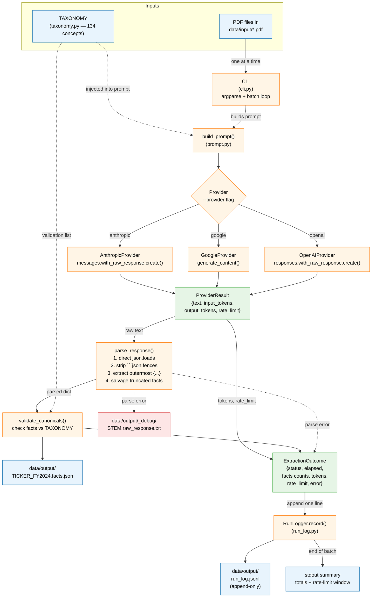

# pdf-extraction

Extract XBRL-style financial facts from a folder of annual report PDFs (US 10-Ks, foreign 20-Fs, IFRS annual reports — anything with financial statements). One JSON file out per PDF in. Works with **Anthropic Claude**, **Google Gemini**, or **OpenAI GPT** as the underlying LLM.

## Project layout

```
pdf-extraction/
├── README.md
├── pyproject.toml             # package metadata, dependencies, console-script entry point
├── .env.example               # template for API-key env vars
├── .gitignore
├── src/
│   └── pdf_extraction/        # the importable package
│       ├── __init__.py
│       ├── __main__.py        # enables `python -m pdf_extraction`
│       ├── cli.py             # argparse + batch loop
│       ├── extractor.py       # PDF → LLM → validated JSON file
│       ├── prompt.py          # extraction prompt
│       ├── taxonomy.py        # canonical taxonomy (134 concepts)
│       └── providers/
│           ├── __init__.py    # PROVIDERS registry
│           ├── base.py        # Provider abstract base class
│           ├── anthropic_provider.py
│           ├── google_provider.py
│           └── openai_provider.py
├── data/
│   ├── input/                 # drop your PDFs here
│   │   └── apple_fy2024_10k.pdf
│   └── output/                # JSON files land here
└── examples/
    └── AAPL_FY2024.facts.json   # reference output (hand-built)
```

The top-level file `extract_financials.py` is a thin shim that adds `src/` to `sys.path` and forwards to the package CLI — useful when you haven't run `pip install -e .` and just want to run the script directly. New code should import from the `pdf_extraction` package.

## Data workflow



The same outcome object feeds both the human-readable JSON file (one per PDF) and the JSONL run log (one line per PDF). The taxonomy is read once and used in two places: it is injected into the prompt so the LLM sees the canonical names it can pick from, and it is used to validate the canonical names that come back.

## How traceability works

Every fact carries three name fields:

| Field | What it is | Example |
|---|---|---|
| `canonical` | Standardized name from `taxonomy.py`. Same across all companies. **Use this for cross-company analysis.** | `Revenue` |
| `concept` | Native taxonomy tag the company uses (`us-gaap:*` / `ifrs:*` / `custom:*`). | `us-gaap:Revenues` |
| `label` | The line-item label EXACTLY as printed, in the original language. | `Total net sales` (Apple) · `Chiffre d'affaires` (a French filer) |

So if you ask "what's the revenue line for Apple, LVMH, and Toyota?", you can join on `canonical = "Revenue"` and still trace each row back to the original wording in the original report.

## Setup

1. **Install Python 3.10+**: `python3 --version`

2. **Create and activate a virtual environment** in the project folder:

   ```bash
   cd "/path/to/pdf extraction"
   python3 -m venv .venv
   source .venv/bin/activate          # macOS / Linux
   # .venv\Scripts\activate           # Windows PowerShell
   ```

   Your shell prompt should now show `(.venv)` at the start.

3. **Install the package** (in editable mode, with the SDK extras you want):

   ```bash
   pip install -e ".[anthropic]"      # just Anthropic
   pip install -e ".[google]"         # just Gemini
   pip install -e ".[openai]"         # just GPT
   pip install -e ".[all]"            # all three SDKs
   ```

   Editable mode (`-e`) means edits to files in `src/` take effect immediately without reinstalling.

   **This step is what creates the `extract-financials` command** in your venv's `bin/`. If you skip it, your shell will say `zsh: command not found: extract-financials`. See the next section if you'd rather run the tool without installing.

4. **Set your API key(s).** Copy `.env.example` to `.env`, fill in the keys you need, then load them into your shell:

   ```bash
   cp .env.example .env
   # edit .env in your editor and paste the key(s)
   set -a; source .env; set +a       # macOS / Linux — loads .env for this shell session
   ```

   To make a key permanent across sessions, add `export ANTHROPIC_API_KEY=...` to `~/.zshrc` (macOS) or `~/.bashrc` (Linux). On Windows: `setx ANTHROPIC_API_KEY "sk-ant-..."` and reopen the shell.

### Re-using the venv later

```bash
cd "/path/to/pdf extraction"
source .venv/bin/activate
extract-financials data/input --out-dir data/output    # short form (after pip install -e .)
# or, if you skipped the install step:
python extract_financials.py data/input --out-dir data/output
```

`deactivate` returns your shell to the system Python.

## Usage

There are **three equivalent ways** to invoke the tool. Pick whichever works in your setup:

| Form | When it works | Example |
|---|---|---|
| `extract-financials …` | Only after `pip install -e ".[…]"` (creates the console script in the venv). Cleanest. | `extract-financials data/input` |
| `python -m pdf_extraction …` | After install, OR with the venv active (the `src/` layout is on `sys.path` once installed). | `python -m pdf_extraction data/input` |
| `python extract_financials.py …` | Always works — the root-level shim adds `src/` to `sys.path` itself. No install needed. | `python extract_financials.py data/input` |

> **`zsh: command not found: extract-financials`?**
> You haven't run `pip install -e ".[anthropic]"` (or you ran it in a different venv). Either run that install now, or fall back to `python extract_financials.py …` which works without installing.

The rest of this section uses `extract-financials` for brevity, but every example works with all three forms.

```bash
# Default: Anthropic Claude Sonnet
# If input folder is named 'input', output goes to a sibling 'output' folder.
extract-financials data/input

# Override the output folder explicitly
extract-financials data/input --out-dir my_results/

# Use Gemini Pro (full model id also accepted)
extract-financials data/input --provider google --model gemini-2.5-pro
extract-financials data/input --provider google --model pro     # alias for the same

# Use Gemini Flash (cheapest)
extract-financials data/input --provider google --model flash

# Use GPT-5
extract-financials data/input --provider openai --model gpt5

# See what would run without spending API credits
extract-financials data/input --dry-run

# Resume after a crash — only processes PDFs without an existing JSON
extract-financials data/input --skip-existing

# Bigger output budget for very dense filings (default is 32000)
extract-financials data/input --max-tokens 64000
```

If the short `extract-financials` form doesn't work, swap it for `python extract_financials.py` and the same flags apply, e.g.:

```bash
python extract_financials.py data/input --provider google --model gemini-2.5-pro
```

### Output behavior

* On success: writes `<TICKER>_FY<YEAR>.facts.json` to the output folder.
* If the model's response is wrapped in markdown fences or prose, the parser
  strips them and recovers the JSON automatically.
* If the response is **truncated** (model ran out of output budget), the parser
  recovers all complete facts and adds `"_truncated": true` to the file. The
  CLI prints a warning suggesting `--max-tokens 64000`. Re-run that filing
  with the higher budget to get the complete set.
* If the response is fundamentally unparseable, the raw text is dumped to
  `<out_dir>/_debug/<stem>.raw_response.txt` for inspection.

### Run log

Every batch run appends a JSONL log (one line per PDF) to `<out_dir>/run_log.jsonl`
by default — override with `--log-file path/to/log.jsonl`. The log is append-only
across runs so you can analyze throughput, token spend, and failure patterns
over time.

Each record carries two timestamps in UTC ISO-8601 with millisecond precision:
`started_at` (when the API call began) and `timestamp` (when the record was
written, ≈ `started_at + elapsed_seconds`).

```jsonc
{
  "timestamp":         "2026-05-09T13:45:32.418Z",   // record written
  "started_at":        "2026-05-09T13:44:45.092Z",   // API call began
  "pdf":               "apple_fy2024_10k.pdf",
  "pdf_size_bytes":    1093835,
  "provider":          "anthropic",
  "model":             "claude-sonnet-4-6",
  "elapsed_seconds":   47.32,
  "status":            "success",                    // success | skipped | parse_error | api_error
  "facts_total":       985,
  "facts_canonical":   612,
  "facts_dimensioned": 80,
  "tokens_input":      32140,
  "tokens_output":     18432,
  "tokens_total":      50572,
  "rate_limit": {
    // Populated from response headers when the provider exposes them.
    // Anthropic and OpenAI return per-minute window info on every response;
    // Google's SDK doesn't surface these headers, so this object is {} for Gemini.
    // VALUES SHOWN HERE ARE PLACEHOLDERS — your numbers come straight from the
    // actual response. They reset every minute (it is a rate-limit window,
    // NOT remaining account credit).
    "tokens_remaining":   "<int from header>",
    "tokens_limit":       "<int from header>",
    "requests_remaining": "<int from header>",
    "requests_limit":     "<int from header>"
  },
  "output_file":       "AAPL_FY2024.facts.json",
  "truncated":         false,
  "error":             null
}
```

The token counts (`tokens_input` / `tokens_output` / `tokens_total`) come
directly from each provider's `usage` field on the response — these are real
per-request metrics, not estimates.

> **Why no remaining-credit field?** None of the three LLM providers expose
> account credit balance through their public APIs. They only return
> per-request usage (recorded as `tokens_*`) and per-minute rate-limit windows
> (recorded as `rate_limit.*`). For real remaining account credit, log into
> the provider billing dashboard.

At the end of every batch the CLI prints a summary like:

```
============================================================
Run summary  (3 PDFs processed)
============================================================
  Succeeded:        3
  Failed:           0
  Skipped:          0
  Total elapsed:    142s
  Total tokens in:  96,420
  Total tokens out: 55,300
  Total tokens:     151,720
  Total facts:      2,940 (1,830 canonical-mapped)
  Run log:          data/output/run_log.jsonl

Rate-limit window after final request (current minute):
  tokens_remaining:      <from header>
  tokens_limit:          <from header>
  ...

ℹ Account credit balance is not exposed by Anthropic / Google / OpenAI APIs.
  Check your provider billing dashboard for remaining account credit.
```

### Analyzing the log

```bash
# Total tokens spent on a recent batch
jq -s 'map(.tokens_total) | add' data/output/run_log.jsonl

# Average elapsed time per successful PDF
jq -s '[.[] | select(.status == "success") | .elapsed_seconds] | add / length' data/output/run_log.jsonl

# Find the slowest filing
jq -s 'max_by(.elapsed_seconds) | {pdf, elapsed_seconds, tokens_total}' data/output/run_log.jsonl

# Throughput in pandas
python3 -c "
import json, pandas as pd
df = pd.DataFrame(json.loads(line) for line in open('data/output/run_log.jsonl'))
print(df.groupby('status').agg({'elapsed_seconds':'sum','tokens_total':'sum'}))
"
```

If you skipped step 3 above (`pip install -e .`), you can still run via the module path: `python -m pdf_extraction data/input`.

### Model aliases

| Provider | Aliases | Default | Underlying models |
|---|---|---|---|
| `anthropic` | `opus`, `sonnet`, `haiku` | `sonnet` | claude-opus-4-6, claude-sonnet-4-6, claude-haiku-4-5 |
| `google` | `pro`, `flash` | `flash` | gemini-2.5-pro, gemini-2.5-flash |
| `openai` | `gpt5`, `gpt5mini`, `gpt4o` | `gpt5mini` | gpt-5, gpt-5-mini, gpt-4o |

You can also pass any full model id (e.g. `--model claude-opus-4-6`) for models that aren't aliased.

## Output schema

```json
{
  "entity": {
    "name": "Apple Inc.", "ticker": "AAPL", "exchange": "NASDAQ",
    "cik": "0000320193", "country": "United States",
    "fiscal_year_end": "09-28", "reporting_currency": "USD",
    "accounting_standard": "US-GAAP"
  },
  "filing": {
    "form": "10-K", "fiscal_year": 2024, "period_end": "2024-09-28",
    "filing_date": "2024-11-01", "auditor": "Ernst & Young LLP",
    "source_pdf": "apple_fy2024_10k.pdf"
  },
  "periods": {
    "FY2024": {"type": "duration", "start": "2023-10-01", "end": "2024-09-28"},
    "instant_2024-09-28": {"type": "instant", "date": "2024-09-28"}
  },
  "facts": [
    {
      "canonical": "Revenue",
      "concept":   "us-gaap:Revenues",
      "label":     "Total net sales",
      "value":     391035,
      "unit":      "USD",
      "scale":     "millions",
      "period":    "FY2024",
      "statement": "IncomeStatement",
      "page":      29
    },
    {
      "canonical":  "SegmentRevenue",
      "concept":    "custom:SegmentNetSales",
      "label":      "Americas",
      "value":      167045,
      "unit":       "USD",
      "scale":      "millions",
      "period":     "FY2024",
      "statement":  "Note_13_Segments",
      "page":       47,
      "dimensions": {"Segment": "Americas"}
    }
  ]
}
```

A reference output (985 facts, hand-checked against the printed Apple 10-K) lives in `examples/AAPL_FY2024.facts.json`.

## Cross-company analysis

The `canonical` field makes this kind of query trivial:

```python
import json, glob

filings = [json.load(open(p)) for p in glob.glob("data/output/*.facts.json")]

for f in filings:
    rev = next((x for x in f["facts"]
                if x["canonical"] == "Revenue"
                and x["period"] == f"FY{f['filing']['fiscal_year']}"
                and "dimensions" not in x), None)
    if rev:
        scale_mult = {"millions": 1e6, "thousands": 1e3, "billions": 1e9, "actual": 1}[rev["scale"]]
        in_currency = rev["value"] * scale_mult
        print(f"{f['entity']['name']:30s} {rev['label']:30s} {in_currency:>20,.0f} {rev['unit']}")
```

The `label` field tells you exactly how each company worded it (in the original language), so you can audit any unexpected match.

## Extending the canonical taxonomy

Open `src/pdf_extraction/taxonomy.py` and add an entry:

```python
TAXONOMY = {
    ...,
    "FreeCashFlow": "Operating cash flow minus capex (often presented in MD&A)",
}
```

The next run will let the LLM choose `FreeCashFlow`. If a fact has no good canonical match, the LLM sets `canonical: null` and you still have `concept` + `label` to work with.

## Cost (rough, per 100-page filing)

| Provider | Model | Cost |
|---|---|---|
| Anthropic | Opus 4.6 | $0.80–$1.50 |
| Anthropic | Sonnet 4.6 | $0.15–$0.40 |
| Anthropic | Haiku 4.5 | $0.03–$0.10 |
| Google | Gemini 2.5 Pro | $0.30–$0.60 |
| Google | Gemini 2.5 Flash | $0.05–$0.15 |
| OpenAI | GPT-5 | $0.50–$1.00 |
| OpenAI | GPT-5-mini | $0.10–$0.25 |

100 filings on Sonnet: ~$25. On Gemini Flash: ~$10.

## Limitations

1. **Output quality varies by provider.** Claude tends to be most thorough on note-level disclosures; Gemini Flash is fast and cheap but more likely to skip non-tabular notes; GPT-5 is in between. For a critical filing, run two providers and diff the outputs.

2. **Large PDFs may exceed per-request limits.** Files over ~32 MB or 200+ pages of dense text can hit provider caps. Split first with `qpdf` or `pdftk`.

3. **Canonical mapping isn't 100% deterministic.** The LLM occasionally picks `null` when a fact would actually fit a canonical name, or maps something inappropriately. The CLI logs any unknown canonical names per filing; spot-check the outputs the first few times.

4. **Errors fail open.** A failed PDF is logged and the batch continues. If the model returns invalid JSON, the raw response is dumped to `<stem>.RAW_RESPONSE.txt` next to the PDF for debugging. Re-run with `--skip-existing` to retry only failures.

## Tips

- Always `--dry-run` first against a new folder to confirm the right files are picked up.
- Default to `--provider google --model flash` for high-volume batches; escalate to `anthropic --model opus` only when you notice quality issues.
- After a batch, sanity-check counts across outputs:
  ```bash
  for f in data/output/*.facts.json; do
    echo -n "$f: "; jq '.facts | length' "$f"
  done
  ```

## Development

This project uses **black** as the formatter and **ruff** as the linter. They are configured in `pyproject.toml` to play nicely together — black handles formatting, ruff only lints (its formatting rules that overlap with black are disabled). Don't run `ruff format`, it will fight black.

Install both (plus pytest) into your active venv:

```bash
pip install -e ".[dev]"            # pulls in black, ruff, pytest
```

Day-to-day commands:

```bash
black .                            # format every file in place
ruff check .                       # lint
ruff check . --fix                 # lint and auto-fix what ruff can
pytest                             # run tests (when present)
```

A typical pre-commit sequence is `black . && ruff check . --fix`. Both tools share the same `line-length = 100` and `target-version = py310`, and both skip `examples/`, `data/`, and `.venv/`.

If you want a single command that does everything, add this to your shell:

```bash
alias lint='black . && ruff check . --fix'
```

### Pre-commit hook (optional)

To run black + ruff automatically on every `git commit`, drop a `.pre-commit-config.yaml` like this in the repo root and `pre-commit install`:

```yaml
repos:
  - repo: https://github.com/psf/black
    rev: 24.10.0
    hooks: [{id: black}]
  - repo: https://github.com/astral-sh/ruff-pre-commit
    rev: v0.7.0
    hooks: [{id: ruff, args: [--fix]}]
```
